[portfolio](https://minhtutkhaing.me/) &nbsp;·&nbsp;
[starlytics](https://www.starlytics.app/) &nbsp;·&nbsp;
[github](https://github.com/minuttt)

> Builder in Singapore, working across AI products and expressive web experiences. 
> I like turning ambitious ideas into things people can actually use.

Right now I am building [Starlytics](https://www.starlytics.app/): predictive 
intelligence for finding breakout YouTube creators before the market catches up.

<samp>python &nbsp; typescript &nbsp; javascript &nbsp; next.js &nbsp; react &nbsp; fastapi &nbsp; flask &nbsp; openvino &nbsp; three.js &nbsp; tailwind &nbsp; git</samp>

**[starlytics](https://github.com/minuttt/Creator-Rocket)** &nbsp;·&nbsp; <samp>python, fastapi, youtube api</samp> 
Predictive creator intelligence built around growth velocity, engagement depth, 
virality signals, and content consistency.

**[mobilise](https://github.com/minuttt/mobilise)** &nbsp;·&nbsp; <samp>typescript, next.js</samp> 
A mobilisation readiness platform for NSmen and commanders, with unit-specific 
checklists, expiry monitoring, acknowledgements, and readiness views.

**[cognivis](https://github.com/minuttt/cognivis-intel)** &nbsp;·&nbsp; <samp>python, openvino, flask</samp> 
Privacy-first, on-device student burnout forecasting using Intel OpenVINO. 
Local inference keeps sensitive data on the user's machine.

**[south pier](https://github.com/minuttt/southpier)** &nbsp;·&nbsp; <samp>typescript, three.js, gsap</samp> 
A cinematic 3D web experience for a Singapore basketball academy, with kinetic 
type, scroll choreography, and interactive motion.

Every graphic on this page is generated by this repository. The portrait is a 
photo transformed into a character grid by
[`scripts/make_portrait.py`](scripts/make_portrait.py). The stats and section 
headings come from GitHub's GraphQL API through a
[daily scheduled action](.github/workflows/stats.yml), which commits only when 
the generated files actually change.

The animation is SMIL contained inside each SVG, so it works in a GitHub README 
without scripts or external widget services. JetBrains Mono is subset and 
embedded directly in the SVG files to keep the character geometry consistent 
across operating systems.

Language totals include public, non-fork repositories only. The year view uses 
the same quiet-to-loud character ramp as the portrait: `:` `+` `#` `@`.

Built from the [ASCII portrait guide](https://burly-handstand-0dc.notion.site/ASCII-Portrait-README-Guide-3a3e3f86338481f0b545ec8120bbf604)
and the [self-generating profile guide](https://agreeable-credit-859.notion.site/A-GitHub-profile-that-generates-itself-3abedfe9a65a81e4afc9daed90cb4e7e).
